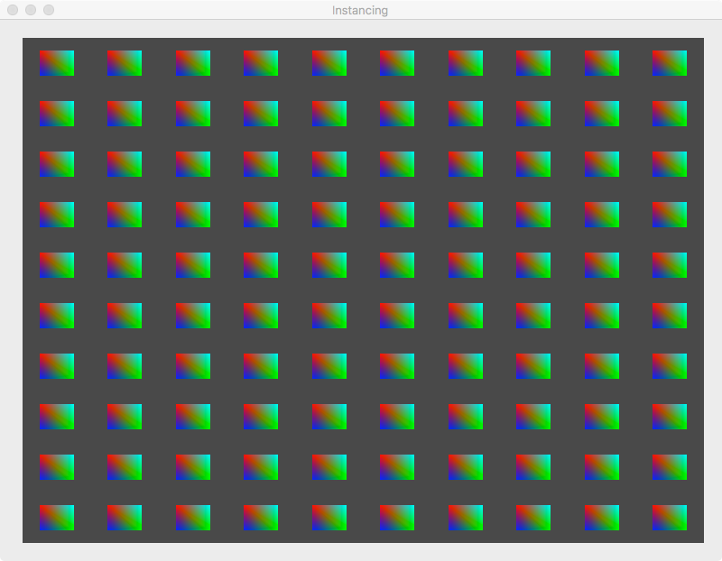
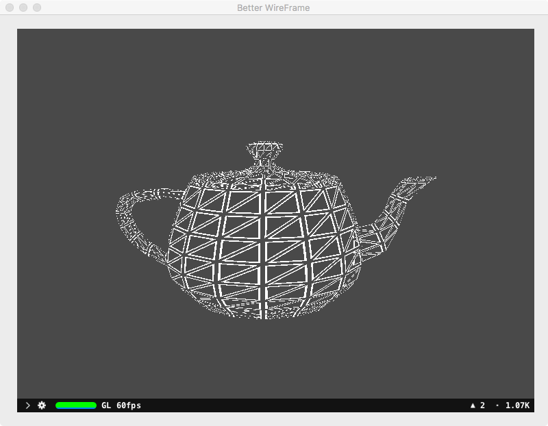
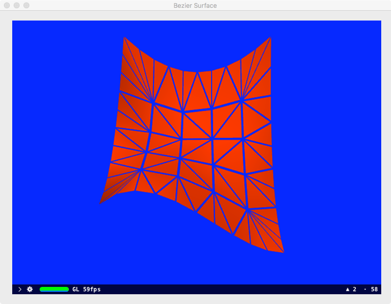

Rationale for this project:

SceneKit supports custom rendering using shader programs written in the OpenGL Shading Language or Metal Shading Language. Most of the demos published instantiate an SCNProgram with a pair of OpenGL vertex+fragment shaders. There is a dearth of information on the certain topics e.g.

a) Instancing,
b) Use of geometry shaders,
c) Use of tessellation Shaders.

Using OpenGL geometry shaders to perform custom rendering in SceneKit is straightforward. However, SceneKit does not play nice when OpenGL tessellation shaders are used. In fact, it took a fair bit of experimentation and guesswork to get such shaders to execute properly within SceneKit's environment.

Two things to bear in mind when using OpenGL shaders for custom rendering viz:
a) all OpenGL functions require a context
b) many OpenGL functions require binding of a vertex array object and an OpenGL program object.

This project consists of 4 demos:

Instancing: Renders 100 coloured quads.

Pulsate: Display a torus oscillating between its normal and expanded shape.

BetterFireFrame: Loads a teapot and display it in a custom wireframe mode.

BezierSurface: Sub-divide a patch in smaller triangles and display it with shrinked triangles.

The OpenGL shaders used are the copyrights of the various authors or publishers.

SceneKit's environment can be useful when it comes to testing OpenGL (or Metal) shaders. 1) Explicit and implicit animations are supported.
2) There is a free camera which allows the programmer to interact manually with SCNNodes.
Zooming in/out is relatively easy. The camera is moved around to view the scene by just simply dragging the mouse on the Macintosh.
3) Multiple lights and cameras can be added to the scene. 
4) The same window can support 2 or more instances of SCNView. 
5) Loading 2D or 3D textures are supported.
6) Not to mention hit testing is available.
7) Model loading is supported.
8) Multiple scenes and SCNViews are supported although rendering performance may suffer.

Weblinks:

The link below discusses the pros and cons of using SCNProgram instantiated with OpenGL shaders.
 
https://blog.wadetregaskis.com/scenekit-shaders/