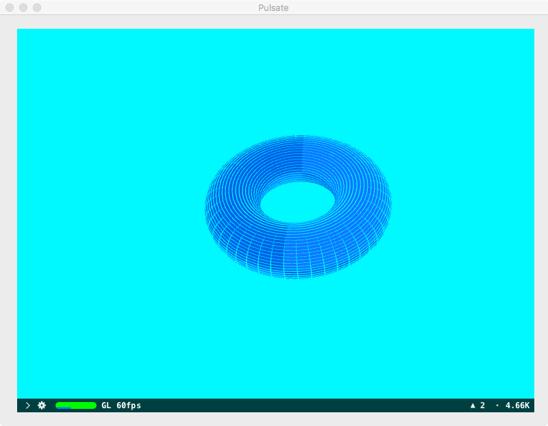

Rationale for this project:

SceneKit supports custom rendering using shader programs written in the OpenGL Shading Language or Metal Shading Language. Most of the demos published instantiate an SCNProgram with a pair of OpenGL vertex+fragment shaders. There is a dearth of information on the certain topics e.g.

a) Instancing,

b) Use of geometry shaders,

c) Use of tessellation Shaders.

Using OpenGL geometry shaders to perform custom rendering in SceneKit is straightforward. However, SceneKit does not play nice when OpenGL tessellation shaders are used. In fact, it took a fair bit of experimentation and guesswork to get such shaders to execute properly within SceneKit's environment.

Two things to bear in mind when using OpenGL shaders for custom rendering viz:

a) all OpenGL functions require a Core OpenGL (CGL) context object to be instantiated and made current.

b) many OpenGL functions require binding of a vertex array object and an OpenGL program object to be installed.

This project consists of 4 demos:

Instancing: Renders 100 coloured quads with the OpenGL call glDrawArraysInstanced.

Pulsate: Display a torus contracting and expanding between its normal and inflated shape.

BetterFireFrame: Loads a teapot and display it in a custom wireframe mode.

BezierSurface: Sub-divide a patch in smaller triangles and display it using shrinked triangles.

The OpenGL shaders used are the copyrights of the various authors or publishers.

The model teapotLowRes.dae is from Apple's WWDC 2014 SceneKit Demo.

SceneKit's environment can be useful when it comes to testing OpenGL (or Metal) shaders. 

1) Explicit and implicit animations are supported.

2) There is a free camera which allows the programmer to interact manually with SCNNodes.
Zooming in/out is relatively easy. The camera is moved around to view the scene by just simply dragging the mouse on the Macintosh.

3) Multiple cameras can be added to the scene. 

4) The same window can support 2 or more instances of SCNView. 

5) Loading 2D or 3D textures are supported.

6) Not to mention hit testing is available.

7) Model loading is supported.

8) Multiple scenes and SCNViews are supported although rendering performance may suffer.

Requirements:

    XCode 8.x or later for compilation.

    macOS 10.12 or later.

The source code of the application is written in Swift 3.x.

It is possible to back port to older versions of Swift and earlier versions of macOS. You must check if the SceneKit framework  calls are supported. There should be little problems with the OpenGL calls. Tessellation requires OpenGL 4.x 

Weblinks:

https://learnopengl.com/Advanced-OpenGL/Instancing

https://learnopengl.com/Advanced-OpenGL/Geometry-Shader

http://web.engr.oregonstate.edu/~mjb/cs519/Handouts/tessellation.1pp.pdf

https://github.com/dalebradshaw/scenekit-lighting-models

The link below discusses the pros and cons of using SCNPrograms instantiated with OpenGL shaders.
 
 
https://blog.wadetregaskis.com/scenekit-shaders/
